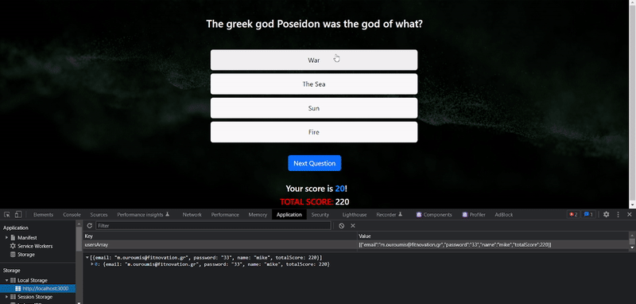

# Quiz Application

Project under development..

Quiz Application based on questions fetched from Open Trivia Database.

## How does it work

When starting, the user has to register with the email, name and password.


After registration or log in, the user has to choose one of the categories that
are fetched from Open Trivia Database.


After choosing the category, the API fetches 10 random questions for the
category and displays them on the screen. The user gets 4 possible answers, one
of which is the correct one. If the user selects the correct answer, the score
and total score increase by 10.


The TOTAL SCORE is saved to the localstorage for every user.



## why I used the localstorage

Localstorage is not the ideal way to store the users' data, but for simplicity
reasons I used it to implement a login/logout and register UI.

## Why I built this application

First of all, I love learning new things about all subjects. This application is
something that I enjoy to run as a user.

Secondly, I am a part of many educational projects for other companies and I
have a natural inclination towards knowledge and education.

## If I had more time...

- I would create a multiplayer game for 2 or more users that are connected from
  different devices and run the quiz simultaneously.
- I would refactor the code to reduce the lines of code.
- I would improve the styling

## How to run the application on localhost

```
$ git clone https://github.com/MikeOuroumis/Quiz-App.git

$ npm install

$ npm start
```

## Tech stack

1. Reactjs
2. Axios
3. Bootstrap
