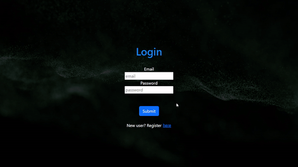
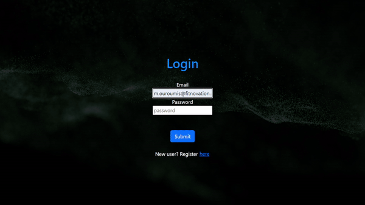
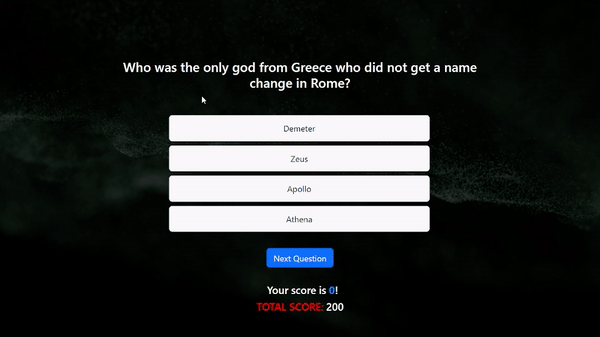

# Quiz Application

Project under development..

Quiz Application based on questions fetched from Open Trivia Database.

## Why I built this application

First of all, I love learning new things about all subjects. This application is
something that I enjoy to run as a user.

Secondly, I am a part of many educational projects for other companies and I
have a natural inclination towards knowledge and education.

## How does it work

When starting, the user has to register with the email, name and password and
then choose a category to start the quiz.





After choosing the category, the API fetches 10 random questions for the
category and displays them on the screen. The user gets four answers, one of
which is the correct one. if the user selects the correct answer, the score and
total score increase by 10.



## How to run the application on localhost

```
$ git clone https://github.com/MikeOuroumis/Quiz-App.git

$ npm install

$ npm start
```

## Technologies

1. Reactjs
2. Bootstrap
